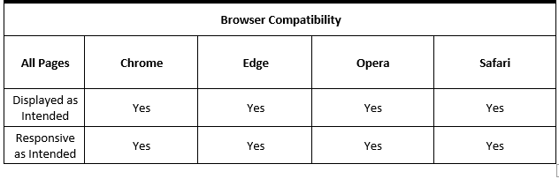
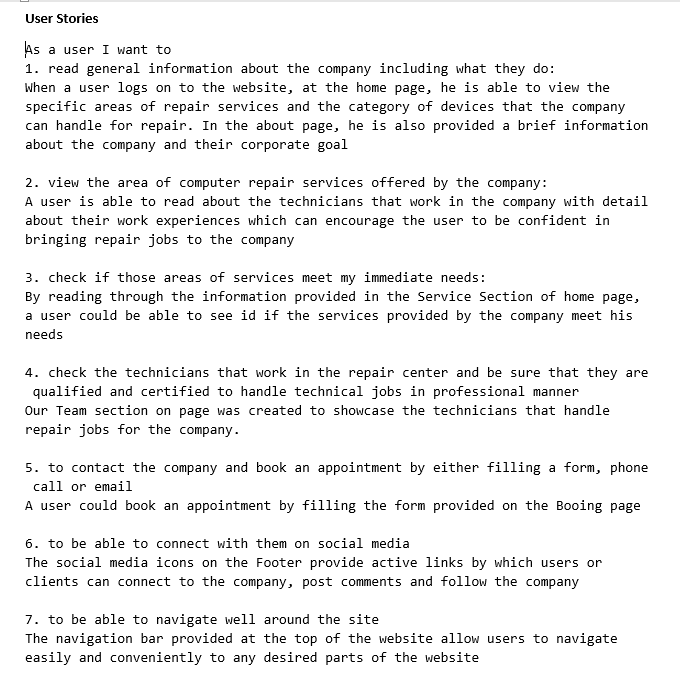
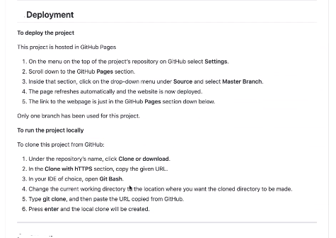

# 1.0 Project Name: Website for Computer Repair Company
The aim of the project is to design a static website for a small business company that deals with repair of personal computers, 
tablets, ipads and mobile phones. The website consists of four pages including Home, About, Booking and Contact page. All pages 
have common header and footer which displays the company's name on the header, contact information and social links on the footer.
They also display a common navigation bar which consists of four menu items that serve as links to the website pages for easy navigation.
Click this link to view the website https://adey-px.github.io/milestone1/

## 2.0 UX
The website is for people who need repair and servicing of their PCs, tablets and mobile devices. They want to get experts who can handle their 
jobs professionally and they want to book an appointment to meet them. So the website consists of a form users can fill to book an appointment.

### 2.1 User stories
As a user I want to 
1. read general information about the company including what they do
2. view the area of computer repair services offered by the company
3. check if those areas of services meet my immediate needs
4. check the technicians that work in the repair center and be sure that they are 
   qualified and certified to handle technical jobs in professional manner
5. to contact the company and book an appointment by either filling a form, phone call or email
6. to be able to connect with them on social media
7. to be able to navigate well around the site 

 
## 3.0 Features
The home page basically consists of a carousel which displays three scrolling images with fading effect. The carousel images are used to present
to users what the company does through picture presentation. The home also consists of the company's foussed area of repair services and a lower section
that shows four top technical personnel who handles repair services for the company.
About page consists a summary information about the company with a group photograph
of the four main guys. 
Booking page has a form that clients can fill and submit in order to book an appointment and request for repair service. 
Contact page consists of a form for contacting the company, google map with a marker on the company's location, address and phone number to contact the company directly.

## 3.1 Existing Features
Feature 1 - Carousel images and Our services section allow users to have overview of what the company has to to offer
Feature 2 - Technicians information on home page enables users to have general ideas of the qualified personnel in the company
Feature 3 - Booking form allows users to book an appointment and request a repair service for their 
Feature 4 - Google map on contact page allows users to get direction to the company's office location

## 3.2 Features Left to Implement
Another feature idea is to connect the Booking form to the company's email so the Admin can get an email alert when a prospective client books 
an appointment. The Web Admin would be able to download the client's information pdf format. The contact form would connect to a database Where form inputs
are stored for future reference.

## 3.3 Languages and Technologies Used
1. <a href="https://en.wikipedia.org/wiki/HTML">HTML5</a>
   The project uses HTML5 for website layout 
2. <a href="https://en.wikipedia.org/wiki/CSS">CSS3</a>
   The project uses CSS3 for styling
3. <a href="https://getbootstrap.com/">Bootstrap 4</a> 
   The project uses Boostrap 4 to create carousel image slider on home page and responsive Navigation bar 
4. <a href="https://ianlunn.github.io/Hover/">Hover.CSS</a>
   It uses Hover.css for button hover
5. <a href="https://fontawesome.com/">Font Awesome</a> 
   It uses Font Awesome for Our services section, Team section and social links
6. <a href="https://fonts.google.com/">Google Font</a> 

## 4.0  Testing
All the internal and external links including menu items on navigation bar works well and the website looks good on Chrome, Mozilla and Edge browsers
The website is responsive on mobile devices 

### 4.1 Code Validation
HTML codes were tested with <a href="https://validator.w3.org/#validate_by_input">W3C MarkUp Validation Service</a>. The codes returned without error.
HTML codes were tested with <a href="https://jigsaw.w3.org/css-validator/">W3C CSS Validation Service</a>. The codes returned without error.

### 4.2 Testing Responsiveness 
</>

### 4.3 Testing Browser Compatibity
</>

### 4.4 Testing User Story 
</>

### 4.5 Bugs
1.	The bug I encountered was the navigation bar not displaying properly at mobile view 
because I used hamburger menu style. 
I fixed this bug by adding some media query for menu-item class by giving it a width 100% at
 max-width: 600px and making it important

2.	At mobile view, menu items also displayed horizontally and scattered instead of vertically so I 
used clear both to separate them and make them display vertically in mobile view

## 5.0 Deployment
The website is hosted on github pages https://adey-px.github.io/milestone1/
Deployment steps: </>

## 6.0 Credits

### 6.1 Content
1. The code for Navigation bar was copied from  <a href="https://getbootstrap.com/docs/4.5/components/navbar/">here</a> 
2. The code for Goolge map was copied from  <a href="https://developers.google.com/maps/documentation/javascript/adding-a-google-map">here</a> platform 
3. The code for Carousel was copied from <a href="https://getbootstrap.com/docs/4.5/components/carousel/">here</a>  
4. The code for Booking form and Contact form was copied from <a href=" https://getbootstrap.com/docs/4.5/components/forms/">here</a>  
5. The texts for Our services section, our Team section and About page were copied from Google search

### 6.2 Media
The photos used in this site were obtained from <a href="images.google.com">Google images</a>

### 6.3 Acknowledgements
The inspiration for this project was my personal idea
